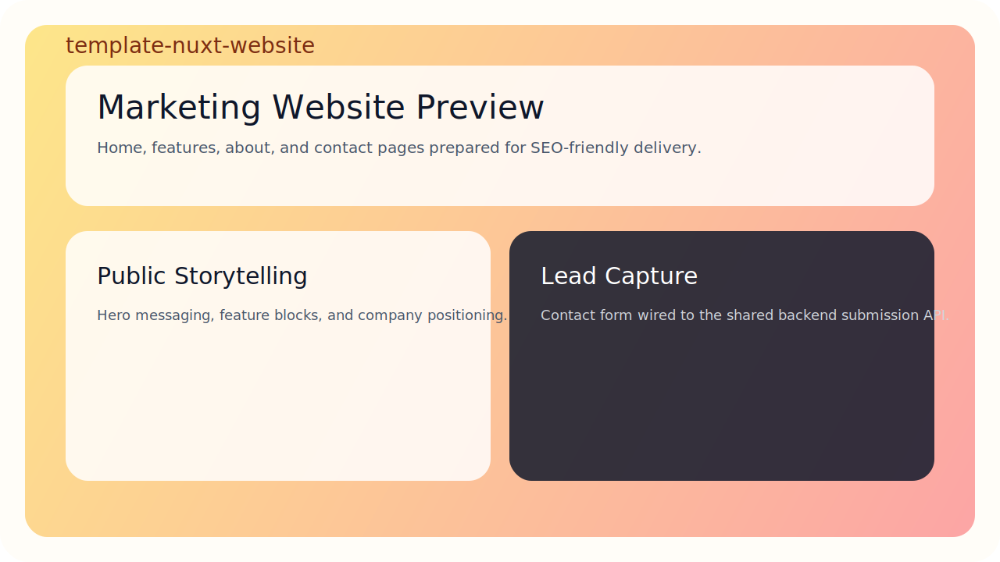
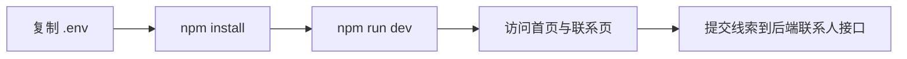
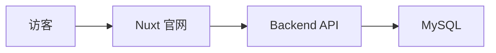
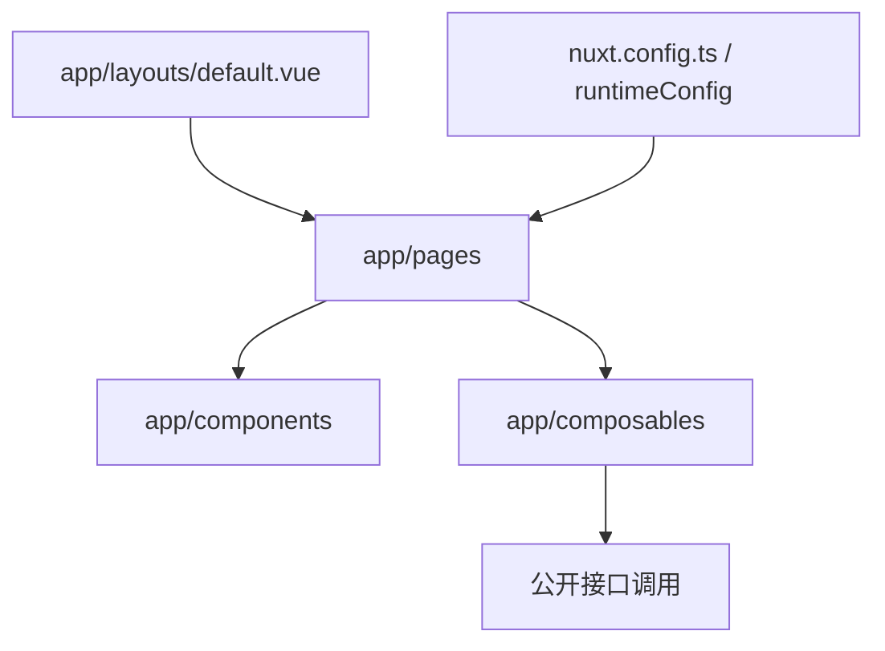
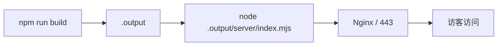

# template-nuxt-website


一套面向创业产品官网 / 营销站的 Nuxt 3 模板，内置首页、特性页、关于页、联系页，并已打通后端联系人表单接口，适合直接作为官网仓库长期复用。

## 预览占位图



## 治理文档

- [LICENSE](./LICENSE)
- [CONTRIBUTING.md](./CONTRIBUTING.md)
- [COMMIT_CONVENTION.md](./COMMIT_CONVENTION.md)
- [CODE_OF_CONDUCT.md](./CODE_OF_CONDUCT.md)
- [SECURITY.md](./SECURITY.md)

## 1. 项目定位

- 技术定位：`Nuxt 3 + Vue 3 + TypeScript`
- 业务定位：公开营销官网、品牌介绍页、线索收集页
- 配合关系：默认与 `template-go-backend` 的联系人接口联动

## 2. 技术栈

- Nuxt `3.21.2`
- Vue `3`
- TypeScript

## 3. 快速开始总览图



## 4. 架构图

### 4.1 系统关系图



### 4.2 站点内部结构图



## 5. 页面结构

已内置页面：

- `/`：首页
- `/features`：产品能力 / 特性页
- `/about`：关于页
- `/contact`：联系咨询页

## 6. 目录结构

- `app/pages`：页面路由
- `app/components`：页面公共组件
- `app/layouts`：布局壳
- `app/composables`：联系人表单等复用逻辑
- `app/types`：前端类型定义
- `app/assets`：样式与资源
- `app/plugins`：SEO 等插件注册
- `nuxt.config.ts`：运行时配置与 Nuxt 主配置

## 7. 本地开发使用方式

### 7.1 安装依赖

```powershell
npm install
```

### 7.2 初始化环境变量

```powershell
Copy-Item .env.example .env
```

关键环境变量：

- `NUXT_PUBLIC_SITE_NAME`：站点名称
- `NUXT_PUBLIC_SITE_TAGLINE`：站点副标题
- `NUXT_PUBLIC_API_BASE`：后端 API 地址

### 7.3 启动开发环境

```powershell
npm run dev
```

默认地址：

- `http://localhost:3000`

## 8. 联系表单说明

联系页默认调用后端接口：

- `POST /api/v1/public/contact-submissions`

提交字段与后端保持统一：

- `name`
- `email`
- `phone`
- `company`
- `message`
- `source`

## 9. 部署方式

### 9.1 部署总览图



### 9.2 Node 服务部署

当前 Nuxt 配置默认走 Node Server 输出。

```powershell
npm run build
node .output/server/index.mjs
```

适合：

- Linux 服务器
- PM2 / systemd 托管
- Nginx 反向代理

### 9.3 Nginx 反向代理建议

- `80/443` 入口交给 Nginx
- 网站主请求转发到 Nuxt Node Server
- `/api/` 可直接反代到后端，也可由 Nuxt 页面直连后端域名

### 9.4 生产环境建议

- 将 `NUXT_PUBLIC_API_BASE` 改为线上 API 地址
- 如接入埋点、SEO、A/B 测试，可优先放在 `app/plugins` 与 `app/composables`

## 10. 常用命令

```powershell
npm run dev
npm run type-check
npm run build
npm run preview
```

## 11. 验证结果

当前模板已实际通过：

- `npm run type-check`
- `npm run build`

## 12. 扩展建议

- 按页面类型继续扩展案例页、定价页、博客页
- 继续保持官网只负责公开内容与线索收集，不把业务后台逻辑塞入本仓库
- 如后续需要国际化，可从 `runtimeConfig + composables + 内容配置` 开始演进
